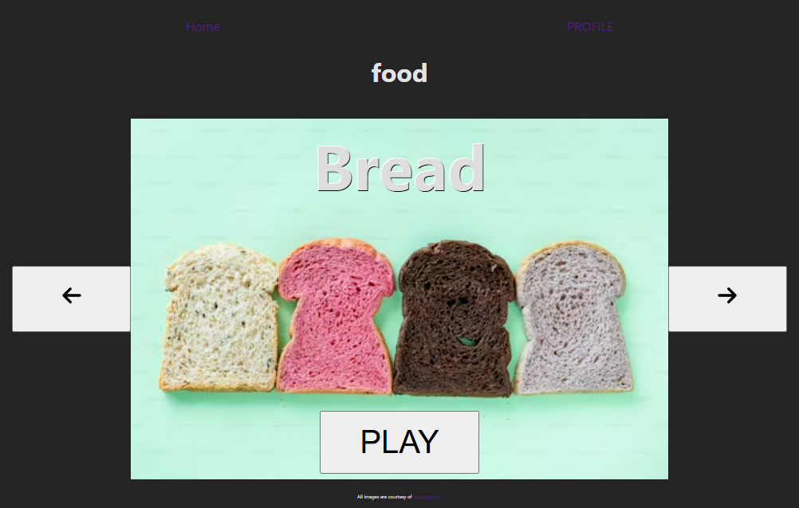

### Toddler Words Learning Application

# Overview

The Toddler Words Learning Application is a web-based platform designed to help toddlers learn basic words across several categories. Inspired by my daughter’s eagerness to learn, this app features real-life images and audio for words in four key categories: Colors, Animals, Food, and Counting. The goal is to make learning fun and accessible, while providing parents with a tool to help their children start recognizing and pronouncing words.

**Frontend (Deployed):** Toddler Words Frontend
**Backend (Deployed):** Toddler Words Backend
**Frontend GitHub Repo:** Toddler Words Frontend GitHub
**Backend GitHub Repo:** Toddler Words Backend GitHub

# Features

### Main Categories:

**Colors:** Includes basic rainbow colors, though orange does not have an audio file available.
**Animals:** A variety of animals from around the world.
**Food:** A selection of foods toddlers might encounter in early life.
**Counting:** Numbers from 1 to 10.

### User-Added Categories: Users can add new words, images, and audio files under the following custom categories:

**Family**
**Places**
**Clothing**
**Things**
(Note: The functionality to save files correctly is still under development.)

# Functionality

**Interactive Learning:** Users can click on a category to be taken to a page displaying:

The word written out.
A corresponding image or color.
A button to play the audio for the word (default audio is pulled from the API: Dictionary API).
Customization: Users can add their own words, images, and audio to enrich the learning experience, though the feature is currently being debugged for proper file-saving functionality.

# Future Plans

**Alphabet:** Plans to include the alphabet with audio, though the file-saving issue must be resolved first.
**Bug Fixes:** Work is underway to correct the file-saving function for uploaded audio files.

# Inspiration

This project was inspired by my daughter, who is eager to learn and engage with new words. I couldn't find a resource that met her needs, so I built this app to provide her with an interactive and child-friendly learning experience.

# Tech Stack

Frontend: React.js
Backend: Node.js, Express.js
Database: MongoDB
Audio API: Dictionary API

# Screenshots & Navigation

###### This is the welcome page when a user is not signed in

this was my wireframe for the welcome page
https://wireframe.cc/iOPRBx

###### This is how the color interactive page displays

This is the wireframe for the color word interactive pages
https://wireframe.cc/fvufJP

###### This is how the color interactive page displays

This is the wireframe for all other interactive pages
https://wireframe.cc/sIq7qQ

###### This is how the color interactive page displays

###### This is how the color interactive page displays

###### This is what the register and sign in page displays

This is the wireframe for the sign up and log in page
https://wireframe.cc/aeJX58

###### This is the form for the user to create a word

###### This is a screen recording to show how to record a word

###### This is how the users preview of their created words looks, the addition to listen to their audio file will be added once the audio blob is saved correctly to play later.

This is the wire from for the user profile showing the word creation form and what the preview section was intended to look like.
https://wireframe.cc/tfkCQs

###### This how the welcome page looks when a user is logged in and has added words to all avalible categories

https://wireframe.cc/ak6U6H

###### This is how the color interactive page displays

###### This is how the color interactive page displays

###### This is how the color interactive page displays

###### This is how the color interactive page displays

# How to Run the Application Locally

# 1. Clone the repositories:

**Frontend:** git clone https://github.com/KatieNinkSmith/Toddler_Words_Frontend
**Backend:** git clone https://github.com/KatieNinkSmith/Toddler_Words_Backend

# 2. Install dependencies:

Navigate to the frontend and backend folders and run:

`js npm install`

# 3. Start the local server:

For the Backend:
`js npm start`
For the Frontend:
`js npm start`

# 4. Visit http://localhost:3000 in your browser to view the app.

# Contributing

If you'd like to contribute to this project, feel free to submit issues or pull requests on GitHub. Contributions are always welcome!

# License

This project is open-source and available under the MIT License.

[def]: ./public/images/colo
