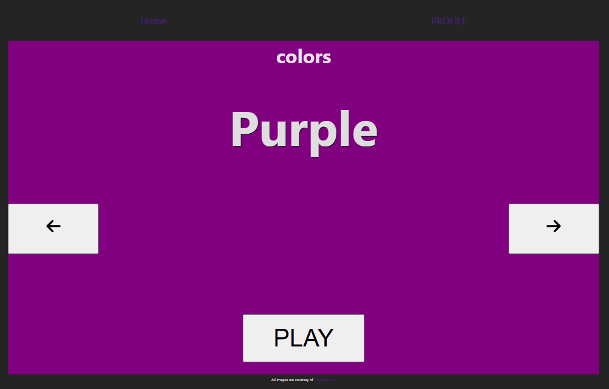
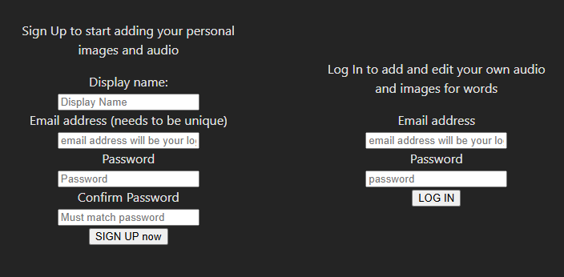

### Toddler Words Learning Application

# Overview

The Toddler Words Learning Application is a web-based platform designed to help toddlers learn basic words across several categories. Inspired by my daughter’s eagerness to learn, this app features real-life images and audio for words in four key categories: Colors, Animals, Food, and Counting. The goal is to make learning fun and accessible, while providing parents with a tool to help their children start recognizing and pronouncing words.

**Frontend (Deployed):** Toddler Words Frontend
**Backend (Deployed):** Toddler Words Backend
**Frontend GitHub Repo:** Toddler Words Frontend GitHub
**Backend GitHub Repo:** Toddler Words Backend GitHub

# Features

### Main Categories:

**Colors:** Includes basic rainbow colors, though orange does not have an audio file available.
**Animals:** A variety of animals from around the world.
**Food:** A selection of foods toddlers might encounter in early life.
**Counting:** Numbers from 1 to 10.

### User-Added Categories: Users can add new words, images, and audio files under the following custom categories:

**Family**
**Places**
**Clothing**
**Things**
(Note: The functionality to save images correctly is still under development.)

# Functionality

**Interactive Learning:** Users can click on a category to be taken to a page displaying:

The word written out.
A corresponding image or color.
A button to play the audio for the word (default audio is pulled from the API: Dictionary API).
Customization: Users can add their own words, images, and audio to enrich the learning experience.

# Future Plans

**Alphabet:** Plans to include the alphabet with audio, though the file-saving issue must be resolved first.

# Inspiration

This project was inspired by my daughter, who is eager to learn and engage with new words. I couldn't find a resource that met her needs, so I built this app to provide her with an interactive and child-friendly learning experience.

# Tech Stack

Frontend: React.js
Backend: Node.js, Express.js
Database: MongoDB
Audio API: Dictionary API

# Screenshots & Navigation

###### Below are some of the pages in the app, including their wireframes:

###### Welcome page (when a user is not signed in):

this was my wireframe for the welcome page
https://wireframe.cc/iOPRBx

### Interactive pages when no user is logged in:

###### Color interactive page:

https://wireframe.cc/fvufJP

###### Animals interactive page:

https://wireframe.cc/sIq7qQ

###### Food interactive page:

###### Counting interactive page:

###### Register and sign in page:

https://wireframe.cc/aeJX58

###### User word creation form:

###### Screen recording for recording a word:

<video width="320" height="240" controls>
  <source src="./public/images/screenRecording.mp4" type="video/mp4">
  Your browser does not support the video tag.
</video>

###### User's preview of created words (Audio playback feature in progress)

https://wireframe.cc/tfkCQs

###### Welcome page (Logged in and has added words to all avalible categories)

https://wireframe.cc/ak6U6H

### Interactive Pages for User-Added Categories:

###### Family interactive page:

###### Places interactive page:

###### Clothing interactive page:

###### Things interactive page:

# How to Run the Application Locally

# 1. Clone the repositories:

**Frontend:** git clone https://github.com/KatieNinkSmith/Toddler_Words_Frontend
**Backend:** git clone https://github.com/KatieNinkSmith/Toddler_Words_Backend

# 2. Install dependencies:

Navigate to the frontend and backend folders and run:

`js npm install`

# 3. Start the local server:

For the Backend:
`js npm start`
For the Frontend:
`js npm start`

# 4. Visit http://localhost:3000 in your browser to view the app.

# Contributing

If you'd like to contribute to this project, feel free to submit issues or pull requests on GitHub. Contributions are always welcome!

# License

This project is open-source and available under the MIT License.

[def]: ./public/images/colo
